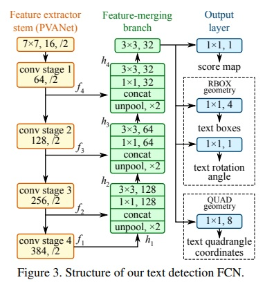
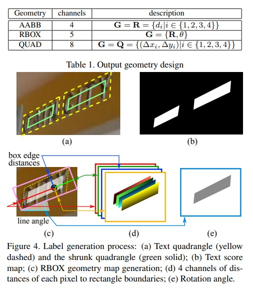

# OCR Guide: Basics and Tesseract

This repository contains a guide and example code on Optical Character Recognition (OCR).

I compiled this material after trying several tutorials and courses; I list the most relevant ones here:

- [Udemy: Optical Character Recognition (OCR) in Python](https://www.udemy.com/course/ocr-optical-character-recognition-in-python/)
- [PyImageSearch: Tutorials on OCR](https://pyimagesearch.com/)

This sub-folder deals with OCR in general and the package Tesseract, which is the most common python library for OCR. This module alone should suffice to start working with OCR.

Table of contents:

- [OCR Guide: Basics and Tesseract](#ocr-guide-basics-and-tesseract)
  - [1. Introduction](#1-introduction)
    - [Installation](#installation)
    - [Course Material](#course-material)
  - [2. OCR with Python and Tesseract](#2-ocr-with-python-and-tesseract)
  - [3. Image Pre-Processing](#3-image-pre-processing)
  - [4. EAST for Natural Scenes](#4-east-for-natural-scenes)
  - [5. OCR in Videos](#5-ocr-in-videos)

## 1. Introduction

Tesseract is currently owned and maintained by Google: [tesseract-ocr/tesseract](https://github.com/tesseract-ocr/tesseract).

It started as a PhD project in the 80's but has evolved since to be the most popular OCR engine; we can use its libraries or binaries to extract text from images.

### Installation

I created a new basic conda environment with [`../conda.yaml`](../conda.yaml) and followed the typical installation steps.

```bash
# Create environment with YAML, incl. packages
conda env create -f conda.yaml
conda activate ocr

# Track any changes and versions you have
pip list --format=freeze > requirements.txt
```

After the environment creation:

    Windows
      1. Install Tesseract OCR EXE
          https://github.com/UB-Mannheim/tesseract/wiki
          Choose the additional languages we want
      2. Set environment variable:
          Path: C:\Program Files\Tesseract-OCR
      3. Test: cmd
          >> tesseract --version
          # tesseract v5.3.1.20230401
      4. Python package: in desired environment
          >> python -m pip install pytesseract
    Mac
      Similar to the Windows installation,
      but steps 1-2 are replaced by
          >> brew install tesseract --all-languages
    
    Linux / WIndows WSL
      Similar to the Windows installation,
      but steps 1-2 are replaced by
          >> sudo apt install tesseract-ocr 

To check the tesseract version and the installed languages:

    tesseract --version
    tesseract --list-langs

If later on we want to add additional language packages, we can install them fetching the data from: [tesseract-ocr/tessdata](https://github.com/tesseract-ocr/tessdata):

    Windows
        1. Download desired package from https://github.com/tesseract-ocr/tessdata
            Example: por.traineddata (portuguese)
        2. Copy file to C:\Program Files\Tesseract-OCR\tessdata
    Linux
        (sudo) apt-get install tesseract-ocr-por # Portuguese

An alternative is to download those packages manually to a local folder and then specify that folder in the `--tessdata-dir` argument.

### Course Material

The material from the course [Optical Character Recognition (OCR) in Python](https://www.udemy.com/course/ocr-optical-character-recognition-in-python/) can be downloaded from this [Drive Link](https://drive.google.com/drive/folders/19b4RUoVMZ_lYeHn0lE2ueyJk36cm9rGB?usp=sharing).

I have the material locally on the folder [`../material/`](../material/), but not committed to the repository.

## 2. OCR with Python and Tesseract

Links:

- [Colab notebook](https://colab.research.google.com/drive/1SGqZJeatvKqxS09rDPtoMtmgzQ1q9mwW?usp=sharing)
- [Material](https://drive.google.com/drive/folders/19b4RUoVMZ_lYeHn0lE2ueyJk36cm9rGB?usp=sharing)

Contents of the section notebook [`01_OCR_with_Python_and_Tesseract.ipynb`](./lab/01_OCR_with_Python_and_Tesseract.ipynb):

- Plot images
- Download and use specific language packages
- Tesseract configuration parameters: folder of packages, language, page segmentation modes (PSM: text block, one word, etc.), etc.
- Plot detected bboxes on images + text (with specific language symbols): custom functions defined
- Usage of the most common API calls:

    ```python
    # Extract string
    pytesseract.image_to_string(...)

    # Extract orientation and script information
    pytesseract.image_to_osd(...)

    # Extrac text and additional info: type of text, confidence, bbox, etc.
    pytesseract.image_to_data(...)
    ```

## 3. Image Pre-Processing

Links:

- [Colab notebook](https://colab.research.google.com/drive/13KCAIRvoEwrvnNgTWyW_eITVjEpnQXdO?usp=sharing)
- [Material](https://drive.google.com/drive/folders/19b4RUoVMZ_lYeHn0lE2ueyJk36cm9rGB?usp=sharing)

Contents of the section notebook [`02_OCR_with_Python_Pre_processing.ipynb`](./lab/02_OCR_with_Python_Pre_processing.ipynb):

- Thresholding: Simple/Binary (global), Otsu (global, bi-modal), Adaptive (local, with Gaussian)
- Color inversion: to white background and dark text
- Image resizing
- Morphological operations for noise removal: Erosion, Dilation, Opening (= Erosion + Dilation), Closing (= Dilation + Erosion)
- Filters: Mean, Gaussian, Median, Bilateral

Summary of the API calls to OpenCV:

```python
# Gray image
gray = cv2.cvtColor(img, cv2.COLOR_BGR2GRAY)

# Thresholding
cv2.threshold(...)
cv2.adaptiveThreshold(...)

# Inversion
invert = 255 - gray

# Resizing
increase = cv2.resize(...)

# Morphological operations
erosion = cv2.erode(gray, np.ones((3,3), np.uint8))
dilation = cv2.dilate(gray, np.ones((3,3), np.uint8))

# Filters
average_blur = cv2.blur(gray, (5,5))
gaussian_blur = cv2.GaussianBlur(gray, (5,5), 0)
median_blur = cv2.medianBlur(gray, 3)
bilateral_filter = cv2.bilateralFilter(gray, 15, 55, 45)
```

## 4. EAST for Natural Scenes

- [Colab notebook](https://colab.research.google.com/drive/1L_sGCRL6itW_v-Jk3TXNR68UHC39Fbah?usp=sharing)
- [Material](https://drive.google.com/drive/folders/19b4RUoVMZ_lYeHn0lE2ueyJk36cm9rGB?usp=sharing)
- [Paper](https://arxiv.org/pdf/1704.03155v2.pdf)

Contents of the section notebook [`03_OCR_with_Python_Text_detection_with_EAST.ipynb`](./lab/03_OCR_with_Python_Text_detection_with_EAST.ipynb):

EAST = Efficient and Accurate Scene Text Detector (2017).

We need to distinguish 2 concepts:

1. Text detection or localization
2. Character recognition

Tesseract does both, but the text detection/localization works well only on structured/controled scenes. EAST is nowadays the best approach to efficiently detect text on unstructured scene images. When EAST is applied, the workflow is the following:

1. Detect/ocalize text with OpenCV using the EAST network.
2. Take the bounding boxes and apply Tesseract to recognize the string in them.

EAST is a fully convolutional neural network (FCN) which returns a score map and bouding box candidates which might contain text ROIs. Then, those ROIs are collapsed using non-maximum supression (NMS).



The EAST model takes a 320x320 RGB image and returns a 80x80 (1) score/confidence map and a (2) map with the bounding box values. The decoding of the bounding boxes is explained in the paper and in [this Stackoverflow post](https://stackoverflow.com/questions/55583306/decoding-geometry-output-of-east-text-detection).



**IMPORTANT**: We need the model, which can be downloaded from different sources:

- [Udemy tutorial](https://drive.google.com/drive/folders/19b4RUoVMZ_lYeHn0lE2ueyJk36cm9rGB?usp=sharing)
- [PyImageSearch tutorial](https://pyimagesearch-code-downloads.s3-us-west-2.amazonaws.com/opencv-text-detection/opencv-text-detection.zip)

The notebook has the following contents:

- An image of a natural scene is loaded, resized to 320x320 and converted to blob.
- The weights of the EAST architecture are loaded to the OpenCV DNN module.
- The image is passed to the model; we obtain `scores` and `geometries`: 80x80 maps of confidences and bboxes, respectively.
- BBox geometries are extracted and non-maximum supression is applied.
  - NOTE: it seems that the model handles oriented bounding boxes, but these are simplified to AABBs.
- The ROIs are upscaled and Tesseract is applied on them to get the text.

Note: PyImageSearch has a very similar tutorial:

- [Blog post / tutorial](https://www.pyimagesearch.com/2018/08/20/opencv-text-detection-east-text-detector/?_ga=2.242979714.1677396935.1685958200-1020982194.1685524223)
- [Source code](https://pyimagesearch-code-downloads.s3-us-west-2.amazonaws.com/opencv-text-detection/opencv-text-detection.zip)
- [Google Colab](https://colab.research.google.com/drive/1J9R4sUQwFJ8eQRcnOIqWmoxDKNeIOsY4?usp=sharing)

## 5. OCR in Videos

:construction:

TBD.
